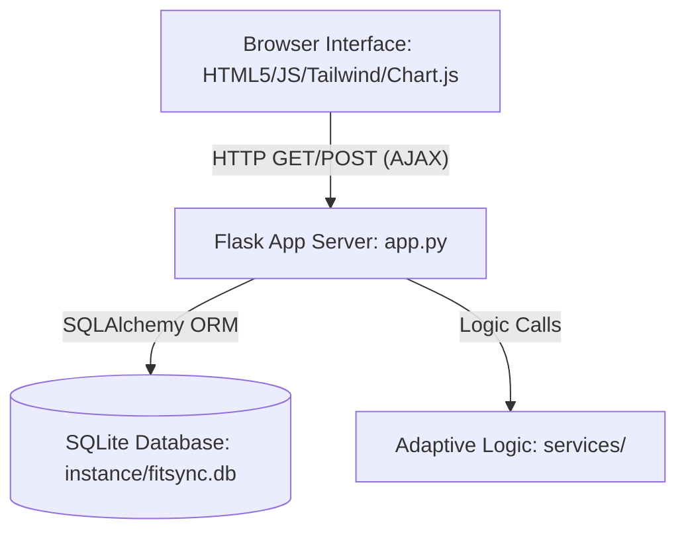

# FitSync AI — Software Architecture

FitSync AI is structured as a unified, single-command Python web application designed for simplicity, ease of deployment, and high reliability during platform demonstrations.

---

## 1. Monolithic Component Design

The application consolidates all front-end presentation logic, back-end REST APIs, database schemas, and AI calculation engines into a single, cohesive codebase.



### Components

* **Frontend Presentation (`templates/`, `static/`)**: Driven by Jinja2 HTML templates, styled with Tailwind CSS, and animated with vanilla JavaScript. Interactive metrics and charts are rendered dynamically in the browser using Chart.js.
* **Server Application Routing (`app.py`)**: A standard Flask application handling page requests, managing session-based user authentication, and serving JSON response endpoints for AJAX actions.
* **Adaptive Calculation Layer (`services/`)**: Custom rule engines that calculate BMR/TDEE targets, generate workout PPL splits, execute missed workout reschedules, and replace food macros.
* **Database Layer (`instance/fitsync.db`)**: SQLite managed via Flask-SQLAlchemy. Tables are auto-initialized and seeded on startup.

---

## 2. SQLite Database Schema

The database utilizes SQLite, mapping the following unified tables:

* `users`: Stores user emails and secure Werkzeug-hashed credentials.
* `user_profiles`: Physical statistics (weight, height, age, gender) and target goals.
* `user_equipments`: List of available workout tools.
* `user_food_preferences`: Preferred, available, or avoided food tags.
* `nutrition_targets`: Daily target calories, protein, carbs, and fats.
* `workout_plans` / `workout_days` / `workout_exercises`: Training splits, instruction sets, and checkboxes.
* `meal_plans` / `meals`: Calculated portion weights and macro balances.
* `progress_records`: Log history containing daily weights and consumed calories for Chart.js graphing.

---

## 3. Browser-Opening Thread

To deliver a zero-configuration experience, `app.py` boots a daemon thread that waits 1.5 seconds for the socket server to bind, then invokes Python's standard `webbrowser.open()` library:

```python
import webbrowser
import threading
import time

def open_browser():
    time.sleep(1.5)
    webbrowser.open("http://127.0.0.1:5000")
```

Setting `app.run(debug=True, use_reloader=False)` ensures that Flask's developmental reloader does not duplicate this background thread or open redundant browser tabs.
