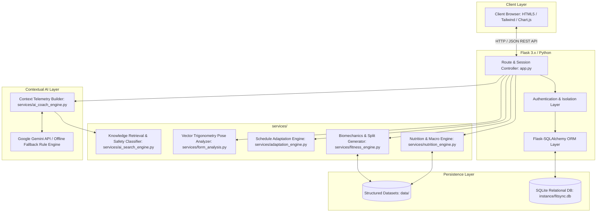
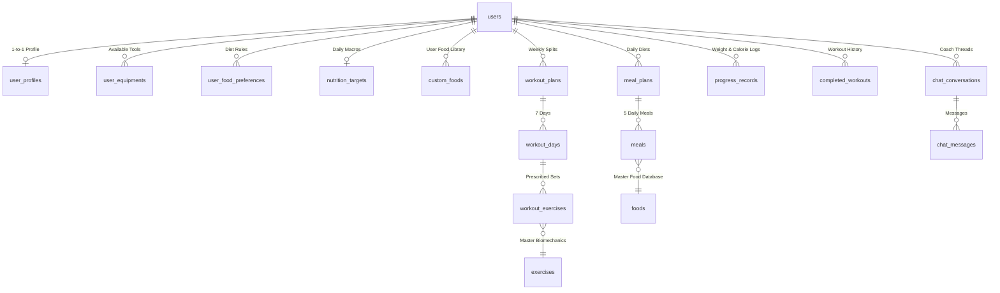

# FitSync AI — Software Architecture & Algorithmic Specification

FitSync AI is an engineering-first, adaptive fitness and nutrition platform built with Python (Flask, Flask-SQLAlchemy, Jinja2, Chart.js, SQLite). The platform pairs deterministic mathematical modeling with controlled natural language assistance.

---

## 1. System Architecture Overview

---

## 2. Core Mathematical Formulations

### 2.1 Basal Metabolic Rate (BMR) & Total Daily Energy Expenditure (TDEE)

Caloric targets are computed deterministically using the **Mifflin-St Jeor** formulation:

$$\text{BMR}_{\text{male}} = 10 \times W_{\text{kg}} + 6.25 \times H_{\text{cm}} - 5 \times A_{\text{years}} + 5$$

$$\text{BMR}_{\text{female}} = 10 \times W_{\text{kg}} + 6.25 \times H_{\text{cm}} - 5 \times A_{\text{years}} - 161$$

$$\text{TDEE} = \text{BMR} \times \alpha_{\text{activity}}$$

Where the activity multiplier $\alpha_{\text{activity}}$ is dynamically evaluated from weekly workout frequency:
* $1\text{–}2\text{ days/week}: \alpha = 1.375$ (Lightly active)
* $3\text{–}4\text{ days/week}: \alpha = 1.550$ (Moderately active)
* $5\text{–}7\text{ days/week}: \alpha = 1.725$ (Very active)

### 2.2 Goal-Based Caloric & Macronutrient Partitioning

$$\text{Target Calories} = \begin{cases} 
\text{TDEE} + 300 & \text{for Muscle Gain} \\
\text{TDEE} - 400 & \text{for Fat Loss} \\
\text{TDEE} & \text{for Maintenance / General Fitness}
\end{cases}$$

Macronutrients are allocated through protein-first constraint solving:
* **Protein Target**: $1.8\text{ g/kg}$ for Muscle Gain; $1.6\text{ g/kg}$ for Fat Loss; $1.2\text{ g/kg}$ for General Fitness ($4\text{ kcal/g}$).
* **Fat Target**: $25\%$ of total caloric budget ($9\text{ kcal/g}$).
* **Carbohydrate Target**: Remaining caloric balance ($4\text{ kcal/g}$):
  $$\text{Carbs}_{\text{grams}} = \frac{\text{Target Calories} - (\text{Protein}_{\text{grams}} \times 4) - (\text{Fat}_{\text{grams}} \times 9)}{4}$$

---

## 3. Algorithmic Engine Specifications

### 3.1 Adaptive Split Generator (`services/fitness_engine.py`)
* **Time Complexity**: $\mathcal{O}(E)$ where $E$ is the exercise catalog size ($|E| = 47$).
* **Constraint Filtering**: Filters exercises by available equipment ($E_{\text{user}} \subseteq E_{\text{available}}$), user fitness level, and primary/secondary muscle targets.
* **Compound Exercise Scoring**: Ranks exercises using a deterministic relevance metric based on compound keyword weighting and target rep-ranges.

### 3.2 Schedule Adaptation & Shift Engine (`services/adaptation_engine.py`)
* **Time Complexity**: $\mathcal{O}(D)$ where $D = 7$ (days in training week).
* **Graph Shifting**: When an active workout is missed, the adaptation engine shifts the incomplete workout forward to the nearest chronological rest day ($D_{\text{rest}}$), rebalancing remaining weekly volume and preventing consecutive-day overtraining.

### 3.3 Food Macro Substitution Solver (`services/nutrition_engine.py`)
* **Time Complexity**: $\mathcal{O}(F \log F)$ where $F$ is the food item pool.
* **Constraint Satisfaction**: Identifies alternatives matching dietary preference (Vegetarian, Vegan, Eggetarian), budget threshold ($\text{Cost} \le \text{Budget}$), and macro equivalence:
  $$\Delta_{\text{macro}} = w_p |\Delta P| + w_c |\Delta C| + w_f |\Delta F|$$
  Minimizing $\Delta_{\text{macro}}$ ensures replacement items preserve the meal's nutritional target.

### 3.4 Vector Trigonometry Joint Angle Analyzer (`services/form_analysis.py`)
* Computes joint angle $\theta$ from 2D coordinate vectors $\vec{u} = A - B$ and $\vec{v} = C - B$:
  $$\cos \theta = \frac{\vec{u} \cdot \vec{v}}{\|\vec{u}\| \|\vec{v}\|} = \frac{u_x v_x + u_y v_y}{\sqrt{u_x^2 + u_y^2} \sqrt{v_x^2 + v_y^2}}$$
  $$\theta = \arccos\left(\text{clamp}(\cos \theta, -1.0, 1.0)\right) \times \frac{180^\circ}{\pi}$$
* Evaluates biomechanical ranges in real time (e.g. Squat knee angle: $<100^\circ$ parallel vs $>160^\circ$ standing).

---

## 4. Relational Database Architecture (17 Tables)

---

## 5. Security, Safety, and Verification Standards

1. **Authentication & Password Security**: Passwords hashed using PBKDF2:SHA256 via Werkzeug (`generate_password_hash`).
2. **Multi-Tenant Data Isolation**: Database queries strictly filter by `user_id == session['user_id']`. Validated across multi-user test suites.
3. **Safety & Medical Scope Enforcement**: Rule-based safety classifier rejects medical diagnosis, prescription drug recommendations, and anabolic steroids, redirecting to certified professionals.
4. **Privacy-Preserving Vision**: Computer vision frames are processed in-memory as ephemeral byte buffers and immediately freed. No biometric or video data is ever stored.
5. **Comprehensive Test Coverage**: 125 automated unit and integration test assertions verifying mathematical accuracy, database consistency, and fail-safe operation.
